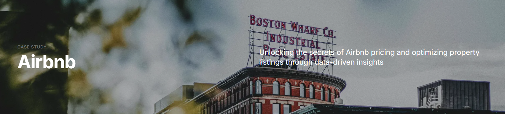

# Unlocking Airbnb Insights: A Data-Driven Solution Powered by CRISP-DM

---

## 🌐 Live Application

You can now access the interactive version clicking here:  
🔗 **[https://airbnb-analysis-sigma.vercel.app](https://airbnb-analysis-sigma.vercel.app)**

[](https://airbnb-analysis-sigma.vercel.app)

---

## Table of Contents
- [Project Description](#project-description)
- [Technologies Used](#🧪-technologies-used)
- [Installations](#⚙️-installations)
- [File Descriptions](#file-descriptions)
- [How to Interact with the Project](#how-to-interact-with-the-project)
- [Results and Discussion](#results-and-discussion)
- [Licensing, Authors, Acknowledgements, etc.](#licensing-authors-acknowledgements)

## Project Description

This project demonstrates the application of the CRISP-DM (Cross Industry Standard Process for Data Mining) framework to analyze and predict Airbnb rental prices in Boston. Using data from the [Boston Airbnb dataset on Kaggle](https://www.kaggle.com/datasets/airbnb/boston/data), the aim is to systematically approach a data mining project, from understanding the business problem to deploying a model. By understanding the factors that influence Airbnb rental prices, hosts can optimize their listings and maximize revenue.

**For a brief overview of a practical client presentation, visit my** [Medium page](https://medium.com/@sindeauxdaniel/here-are-the-essentials-you-should-consider-before-pricing-your-airbnb-86ba84a68c2b).

### Significance

As a former consultant and current data scientist, this project serves as an educational resource, illustrating that by clearly identifying and articulating the problem, we ensure that the project's goals align with the client's objectives, address the right scope, and focus on specific challenges. This structured approach not only enhances the clarity and effectiveness of the analysis but also provides a replicable methodology for future data mining projects.

### Objectives

The primary objectives of this project are:
- **Identify and Articulate the Business Problem**: Understand the client's objectives, the scope of the issue, and the specific challenges related to Airbnb rental pricing in Boston.
- **Data Exploration and Understanding**: Gain insights from the dataset to identify key factors influencing rental prices.
- **Data Preparation and Cleaning**: Process the dataset to ensure it is suitable for analysis and modeling.
- **Model Building and Evaluation**: Develop models to estimate rental prices and evaluate their performance.

## 🧪 Technologies Used

- **Python** for EDA and data processing (`eda/` folder)
- **Jupyter Notebooks** for CRISP-DM workflow
- **Next.js + React + Tailwind CSS** for the web app (`my-app/` folder)
- **Vercel** for frontend hosting and CI/CD

## ⚙️ Installations

This project consists of two parts:
A CRISP-DM-based data analysis workflow in Python (via Jupyter Notebook)
A Next.js web app that displays the insights from the analysis

You can work with either or both components depending on your needs.

### 📊 1. Run the CRISP-DM Analysis Locally (Jupyter Notebook)

#### ✅ Prerequisites

Python 3.7 or higher
Jupyter Notebook or JupyterLab
Git (to clone the repo)

#### 🚀 Setup Instructions

```bash
# Clone the repository
git clone https://github.com/danielsbraga/CRISP-DM-Airbnb-Analysis.git
cd CRISP-DM-Airbnb-Analysis

# Create a virtual environment
python -m venv venv
source venv/bin/activate  # On Windows: venv\Scripts\activate

# Install dependencies
pip install -r requirements.txt

# Launch the Jupyter notebook
jupyter notebook eda/AirbnbAnalysis.ipynb
```

This will open the notebook where you can explore the full data science process using the CRISP-DM framework: from business understanding through data exploration and visualization.

### 🖥️ 2. Run the Frontend App Locally (Next.js)

If you want to run the interactive web dashboard on your machine:

#### ✅ Prerequisites

```bash
# Navigate to the frontend app directory
cd my-app

# Install dependencies
npm install

# Start the development server
npm run dev

# Then open this URL in your browser
http://localhost:3000
```

This will launch the frontend version of the project, allowing users to explore charts and summaries derived from the data analysis.

## 📁 File Descriptions

Overview of the main files and directories in the repository:

- `README.md` This file. Provides project context, setup instructions, and links.
- `AirbnbAnalysis.ipynb` Jupyter Notebook implementing the CRISP-DM methodology with exploratory data analysis (EDA) on Airbnb listings.
- `requirements.txt` Lists the Python dependencies required to run the Jupyter notebook and analysis code.
- `plots/` Folder containing generated plots and visualizations used during the analysis phase.
- `data/` Contains the dataset(s) used for analysis. May include raw and/or preprocessed files.
- `my-app/` The Next.js frontend application that presents key insights via an interactive web interface. Deployed to [airbnb-analysis-sigma.vercel.app](https://airbnb-analysis-sigma.vercel.app).


## How to Interact with the Project
The dataset use here is open source. I strongly advise you to make your own project using CRISP-DM. I would very much like to see the different questions you had and how you made it.
If you enjoyed reading my notebook, feel free to send me any comments so we can engage and discuss further!

## Results and Discussion
Considering the Main Points of this analysis,
1. The first thing you should look for is what does the competition in your city look like. If you have an apartment, compare what you provide with these types of properties.
2. Pricing tends to be relatively consistent across different property types. The value you provide has more impact in other features.
3. Middle-range prices are the most common, while higher and lower prices are less frequent.
4. location of your homestay significantly impacts its value. The most expensive areas are typically close to key attractions such as the city center, tourist spots, the airport, and the coast.
5. The number of accommodates is the most critical feature. Guests value options that fit their needs, such as elevators, TVs, air conditioning, and internet. Some of these amenities might be challenging to provide, but creativity in offering these can be highly valuable.
6. If you have an extra room, add a bed! Properties if more beds, bedrooms, and guests included, generally have higher prices.
7. Hosts with more listings tend to charge higher prices, possibly due to a more professional or business-like approach. Consider asking experienced hosts for tips on attracting high-quality clients.
8. Information like summary, host about and review scores rating, generally considered of high importance, do not impact in the value of homestays. Indeed, the quality of these descriptions is expected at any price condition you place. You must have then if you want to consider having any AirBnb accommodations.

## Licensing, Authors, Acknowledgements
This project wouldn't be possible without the help of my mentors at Udacity. Follow their [Udacity course](https://www.udacity.com/course/data-scientist-nanodegree--nd025) to learn more.
